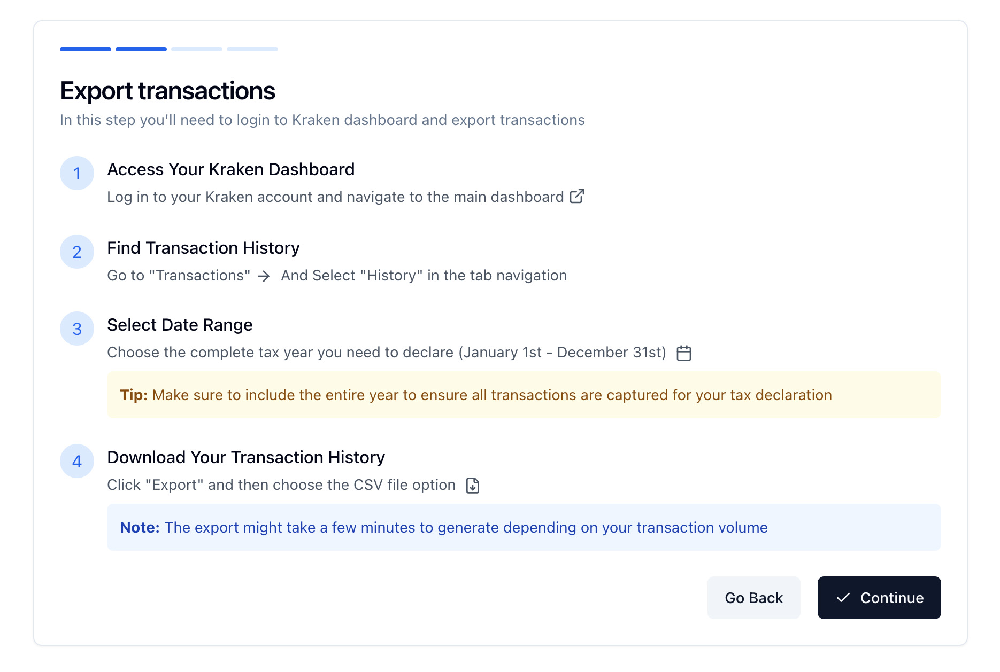
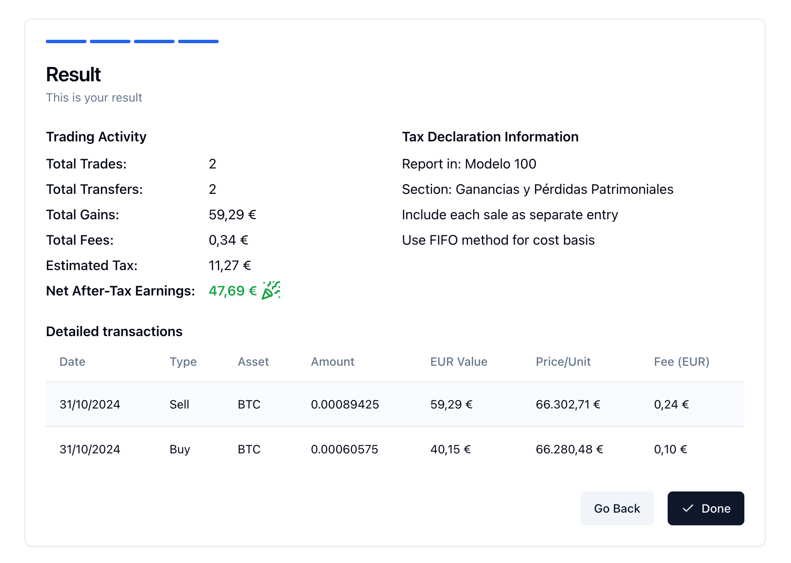

# crypto-tax-assistant

A small react app fully running in the browser to help the user
with their crypto tax declaration process in Spain


## TODO
 - [x] Improve client documentation for exactly what field to fill
 - [x] Replace custom parser with a more robust csv-parse library
 - [x] Add better error handling for potential malformed data
 - [ ] Put i18n in place everywhere
 - [ ] Add a toggle for dark mode

## Installation & Usage

[PNPM package manager](https://pnpm.io) is preferred due to its benefits in performance and workspace handling

1. Step one: `pnpm install`
2. Step two: `pnpm run dev`
3. Done! 🚀

## Testing E2E

```shell
pnpm run test
# Or for running in an interactive mode
pnpm run test:ui
```

### Documentation

[UI Components Documentation at ShadCN UI](https://ui.shadcn.com/docs)

[Playwright Documentation](https://playwright.dev)

### Screenshots



